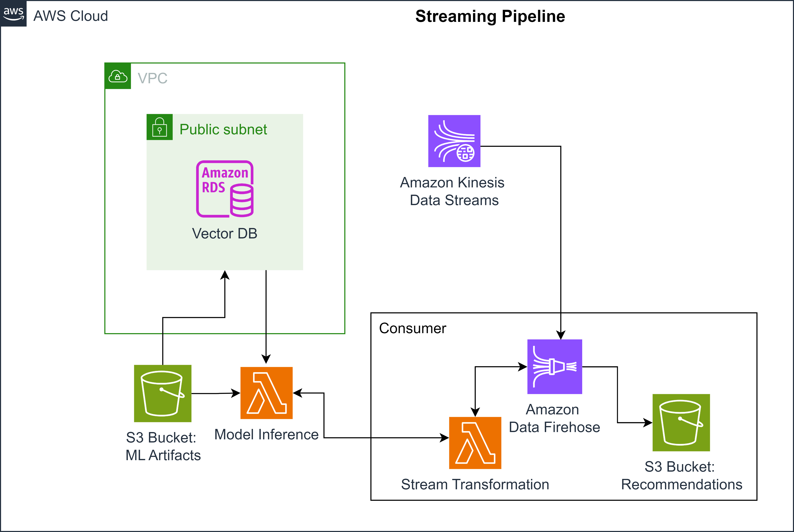

# End-to-End Batch and Streaming Data Pipelines

This project demonstrates the implementation of end-to-end batch and streaming data pipelines to meet stakeholder requirements for a product recommendation system. It involves ingesting, transforming, and processing data using AWS services, creating a vector database, and deploying real-time recommendation pipelines.

## Table of Contents
- [Project Overview](#project-overview)
- [Architecture](#architecture)
- [Batch Pipeline](#1---batch-pipeline)
- [Vector Database](#2---vector-database)
- [Streaming Pipeline](#3---streaming-pipeline)
- [Technologies Used](#technologies-used)
- [Setup and Execution](#setup-and-execution)
  - [1. Batch Pipeline](#1-batch-pipeline)
  - [2. Vector Database](#2-vector-database)
  - [3. Streaming Pipeline](#3-streaming-pipeline)
- [Conclusion](#conclusion)

## Project Overview

The goal of this project is to implement batch and streaming architectures to serve training data for a recommendation system and to provide real-time product recommendations based on user activity. The project includes:

1. **Batch Pipeline**: Transforms raw product and user data into training data.
2. **Vector Database**: Stores embeddings generated from the trained model.
3. **Streaming Pipeline**: Provides real-time recommendations by processing user activity in real time.

## Architecture

### Batch Pipeline Architecture
The batch pipeline ingests data from a MySQL database, processes it using AWS Glue ETL, and stores the transformed data in Amazon S3 for model training.

### Streaming Pipeline Architecture
The streaming pipeline uses AWS services like Kinesis Data Streams and Lambda functions to handle real-time data ingestion, processing, and transformation to generate recommendations.

## 1 - Batch Pipeline

The batch pipeline starts by connecting to an Amazon RDS MySQL database to extract product and user data, including ratings. The data is then transformed using AWS Glue ETL and stored in Amazon S3. The output serves as the training dataset for a recommendation model.

## 2 - Vector Database

The trained recommendation model generates embeddings, which are stored in a PostgreSQL database with the `pgvector` extension. This vector database allows for quick retrieval of similar items, enabling fast recommendation results.

## 3 - Streaming Pipeline

The streaming pipeline uses AWS Kinesis Data Streams to receive live user activity data. The data is processed in real-time using a Lambda function and then stored in an Amazon S3 bucket. The recommendation system retrieves embeddings from the vector database to provide recommendations.

## Technologies Used

- **Amazon RDS MySQL**: Data storage for product and user information
- **AWS Glue**: ETL for data transformation
- **Amazon S3**: Data storage for transformed data and model artifacts
- **Terraform**: Infrastructure as Code (IaC) for resource provisioning
- **PostgreSQL**: Vector database for embedding storage (`pgvector` extension)
- **AWS Lambda**: Serverless compute for real-time processing
- **AWS Kinesis Data Streams**: Real-time data ingestion
- **AWS Kinesis Firehose**: Data delivery to Amazon S3
- **Python**: Scripts for data manipulation and processing

## Setup and Execution

### 1. Batch Pipeline

1. Connect to the RDS MySQL database to verify the source data.
2. Use Terraform to set up AWS Glue ETL and S3 resources.
3. Run the AWS Glue job to process and store the data.

### 2. Vector Database

1. Use Terraform to provision a PostgreSQL database with the `pgvector` extension.
2. Import embeddings from S3 into the vector database using provided SQL scripts.

### 3. Streaming Pipeline

1. Use Terraform to set up Kinesis Data Streams, Firehose, Lambda, and S3 resources.
2. Configure the Lambda function for real-time processing and connect it to the vector database.
3. Monitor data ingestion and recommendation outputs.

## Conclusion

This project showcases how to design and implement batch and streaming data pipelines using AWS services. It demonstrates the integration of multiple AWS components to build a functional recommendation system that can handle both offline training and real-time processing.
